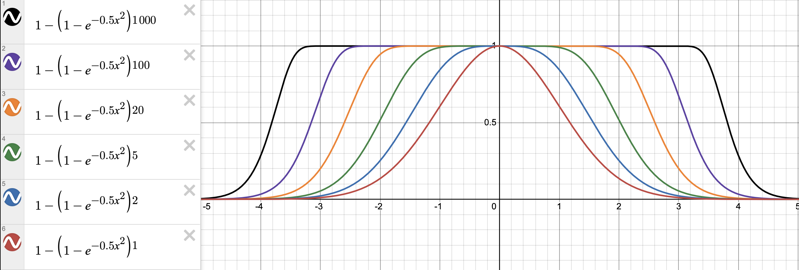
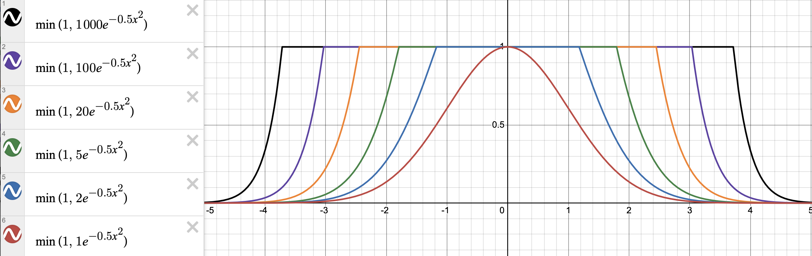
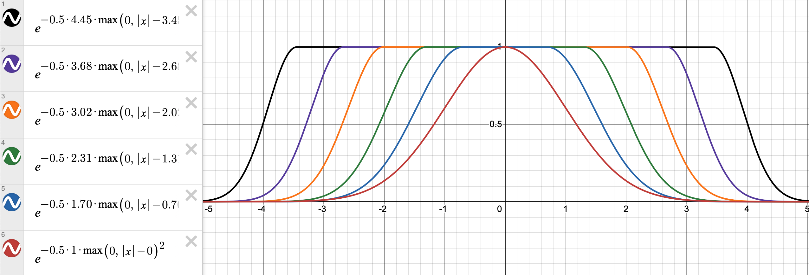

# Spark LoD Rendering

## NewSparkRenderer

The new class `NewSparkRenderer` is an experimental rewrite of `SparkRenderer` that features a number of new capabilities, including:
- Level-of-Detail Gaussian splat rendering with a fixed splat rendering budget N, with near-constant rendering complexity regardless of viewpoint or number of total splats.
- LoD rendering across multiple SplatMeshes simultaneously
- On-demand (in background WebWorker) and fast LoD tree generation after loading any splat file
- Optionally pre-build LoD tree and store in "extended SPZ" compressed format (only 30%-ish larger than original input SPZ)
- High-precision intermediate global splat encoding, no need for camera-renderer tricks
- Eliminted render pass for splat sort metric computation, folded it into splat generation pass, using multiple render targets

### Enabling LoD

Unlike in `SparkRenderer`, the `NewSparkRenderer` must be explicitly added to the scene to enable rendering.

LoD support is enabled by default via `NewSparkRenderer.enableLod = true`. To adjust the LoD detail, adjust the parameters `NewSparkRenderer.lodSplatCount` to directly set the max # of LoD splats to render (defaults to 1.5 M on desktop, 500K on mobile), or `NewSparkRenderer.lodSplatScale` to a value other than 1.0 to scale the default count (e.g. 2.0 will render 3.0 M on desktop and 1.0 M on mobile). The splat budget is in aggregate across all LoDed `SplatMesh`es in the scene.

Additional parameters `.outsideFoveate` and `.behindFoveate` can be set to control how LoD splats are allocated between the view frustum, just outside the view frustum, and behind the observer. Setting these foveate values to 0.1 for example will result in splats 10x larger than inside the frustum.

To enable LoD support for a particular `SplatMesh`, set `lod: true` when constructing the `SplatMesh`, or you can do set this for `PackedSplats` when initializing it. This will instruct Spark to run the Quick LoD algorithm on-demand after loading. This will create a new LoD-specific `PackedSplats` located at `SplatMesh.packedSplats.lodSplats` (a `PackedSplats` within the regular non-LoD `PackedSplats`). This organization allows us to have both LoD and non-LoD `PackedSplats` for the same `SplatMesh` that can be switched between instantaneously.

Setting `nonLod: true` for `SplatMesh` and `PackedSplats` will instruct Spark to create both a regular non-LoD `PackedSplats` (what we would normally get if we didn't set `lod: true`) and a LoD-specific one, both accessible at `SplatMesh.packedSplats` and `SplatMesh.packedSplats.lodSplats`. Each `SplatMesh` also has a property `.enableLod` that is by default set to `undefined`, which will render the LoD splats if available, otherwise the non-LoD splats. Setting `.enableLoD` to `true` or `false` will force only rendering that particular version (if it exists). Setting `nonLod: true` runs asynchronous splat loading in an interesting way: First it decodes the non-LoD splats and signals loading completing (`await packedSplats.initialized`), but the Quick LoD algorithm will run in the background, and once it's complete the LoD version will be swapped in. Alternatively, setting `nonLod: "wait"` will instruct Spark to produce both the LoD and non-LoD versions, but to wait until both are finished before finishing resolving the loading promise.

Each `SplatMesh` also has its own individual `outsideFoveate` and `behindFoveate` parameters that override the global parameters for that `SplatMesh` only. You can additionally set `lodScale` to a value other than 1.0 to up-weight or down-weight the splat budget for this `SplatMesh`. Setting `lodScale` to 2.0 for example will target splats half the size of the normal budget.

---

## Level-of-Detail Gaussian Splat Tree

"Level-of-Detail" (LoD) refers to a graphics technique where 3D geometry is represented by multiple versions with varying levels of detail, selected at render-time to balance rendering speed and rendering quality/detail. One example of this is MipMap texturing, where a 2D texture is downsampled in powers of 2 to form a "pyramid" of textures where the level is selected during rendering so that texture pixel sizes roughly match the rendered screen pixel size.

A "Gaussian splat tree" is similar conceptually: high-detail splats are downsampled into coarser splats, represented as a tree node with its children. By merging all splats into a single "root splat" that covers the entire scene with average color and shape, we form a tree/hierarchy of splats. Assuming the downsampled splats are a faithful representation of their direct children, then by induction an interior node splat is a downsampled representation of its entire subtree's leaf splats. Therefore, starting at the root we can compute a "cut" of the tree, render only the nodes at the frontier, and all original leaf node splats will have been merged into exactly one splat in the frontier.

The Spark LoD renderer computes these cuts in a background worker thread, using an algorithm that traverses the splat tree from the root to find a set of frontier nodes with the following properties:
- Similar screen-space size: Distribute the detail evenly across the screen
- No smaller than a screen-space pixel: Don't waste splats on unneeded additional detail
- Maximum splat count `N`: Effectively splat rendering budget/cost

This algorithm can run in `O(N log N)` time, a function of the number of *rendered* splats, and independent of the total number of splats in the splat tree. A generalization of this algorithm is to compute multiple cuts simultaneously across multiple splat trees, distributing these N splats across multiple SplatMeshes, globally optimizing for screen-space detail.

For details on this algorithm, refer to `lod_tree::traverse_lod_trees()` in [rust/spark-internal-rs/src/lod_tree.rs](../../rust/spark-internal-rs/src/lod_tree.rs).

---

### Downsampling Splats

We downsample splats by merging a set of splats into a single "average" splat. We follow the literature cited by Kerbl et al. to efficiently compute the center and 3D covariance of a downsampled splat that best represents the input splats, analgous how the convolution of Gaussian kernels yields another Gaussian. The splat contributions are weighted by the product of their opacity and "surface area" (modeled as an ellipsoid): `weight = opacity * area`. Splat colors (including spherical harmonics) are computed as a weighted sum of the individal slat colors.

For downsampling code, refer to `GsplatArray::new_merged()` in [rust/spark-lib/src/gsplat.rs](../../rust/spark-lib/src/gsplat.rs).

The downsampled splat opacity is a more complicated matter, however. In traditional Gaussian splatting the maximum opacity parameter is `A=1.0` which results in `opacity(x) = A * e^(-0.5 * x^2)`. If we had `K` identical splats at the same location, the combined opacity is `opacity(x) = 1 - (1 - (e^(-0.5 * x^2)) ^ K)`. As `K` grows larger, this becomes a very non-Gaussian profile, so the traditional opacity parameterization is insufficient to represent the appearance of these downsampled/merged splats.



Kerbl et al. address this problem by extending opacity beyond 1.0 and using `opacity(x) = min(1.0, A * e^(-0.5 * x^2))` and estimating this value by inverting the splat weighting formula: `opacity = weight / area`, where `weight` is the sum of the individual splat weights and `area` is the surface area of the merged splat ellipsoid. As `A` grows larger (more splats merged) the profile has a visually objectionable corner:



Spark addresses this by approximating both plots using another function: for `D <= 1.0` we use the usual `opacity(x) = D * e^(-0.5 * x^2)`, but for `D > 1.0` we use `opacity(x) = e^(-0.5 * D * (|x| - (D - 1))^2)`, a Gaussian that's "shifted outward" in both directions by `(D - 1)` and whose slope steepens by `D`:



We match our function against the Kerbl et al. function via experimentation, finding this interesting family of functions: `D := sqrt(1 + e ln(A))`, which has as similar opacity profile but no "corner" - the transitions from maximum are smooth. We note that A=1000 corresponds to D=4.45, and so the range `D=0..5` seems to encode most of the reasonable range. Because we don't need as much resolution when `D > 1.0` we further map the range `D=1..5` to `1..2` via simple linear scaling. As a "hack" to be able to encode our new opacity D in 8 bytes, we finally map `D=0..1` to `0..0.5` and `D=1..2` to `0.5..1.0`, losing 1 bit of precision when `alpha < 1.0`. To summarize it all, to decode `D` from `stored_u8`:
```
// Map 0..255 to 0..1
float D = stored_u8 / 255
// Map 0..1 to 0..2
D *= 2

if (D > 1.0) {
  // Map D=1..2 to D=1..5
  D = 4 * D - 3
}
// D now 0..5
```

Finally, we need to expand the rendering range to accommodate the larger footprint of the function, as a funciton of D. We empirically set:
```
adjustedStdDev = maxStdDev + 0.7 * (D - 1.0)
```
Depending on the initial range of maxStdDev (typically in the range sqrt(5)..3) the effective maximum std dev will expand to accommodate the shift.

---

### Quick LoD Algorithm

Using our downsampling method and extended opacity rendering profile, Spark implements an LoD splat tree construction method based on voxel octrees. We partition space into series of recursive cube grids with width/step 2^level, where level is an integer (can be negative and positive).

Starting with an initial set of input splats, we place each splat into its "natural" voxel, defined as the voxel octree level where the splat's size is within `0.5*step..step` (smaller would be in the level below, larger above). We define a splat's size as twice the maximum of its x/y/z scales: `2 * max(scale.x, scale.y, scale.z)`, approximately one standard deviation from the center. For merged splat opacities `D > 1.0`, we increase its size to account for the shift in the Spark opacity function: `2 * max(scale.x, scale.y, scale.z) * max(1, D)`.

Each input splat will be a "leaf node" in the splat tree and will be included as-is in the output splat set. Starting from the minimum level (most detailed), we visit every voxel in the octree at that level using a hash on ivec3 cube grid coordinate. If there is more than one splat center contained within that voxel, merge/downsample them into a single splat and create a new internal tree node from this splat and attach its input splats as children.

Once we've visited all the cells in a level we have exactly 1 splat per voxel cell. We increase the level by one, increasing the width/step of the cube grid to the next power of 2, going up the octree hierarchy one level. We again visit all voxels at this level, and create a new merged/downsampled splat for any voxel with more than splat and add it to the splat tree. By construction, many interior nodes will have at most 8 children since they will be merging splats in their 8 octree children, each with exactly one splat. Splats placed in their "natural" voxel at the beginning may result in more than 8 children however. Spark internally encodes the splat tree such that the maximum number of direct node children is 65535 (encoded as a uint16).

We continue merging up the hierarchy until our remaining splats are all within a 2x2x2 voxel footprint in the octree. We need this termination condition because splats whose centers are on opposite sides of the origin will never end up in the same voxel. We perform one final splat merge/downsample to create the splat tree root node.

As a final step, we take a linearized array of all splats in the tree and shuffle them so that the root node is at index 0, the children indices are always greater than the parent index, and the direct children of a node are located consecutively in the array. We traverse the tree in a top-down manner to create a new index ordering and then shuffles all the splat data accordingly. This tree node ordering allows us to encode the node children lists compactly: we can simply store `child_count` and `child_start` since the children are located consecutively, resulting in a fixed storage cost per splat node

For more details on the algorithm, refer to `quick_lod::compute_lod_tree()` in [rust/spark-lib/src/quick_lod.rs](../../rust/spark-lib/src/quick_lod.rs).

---

### Non-Integer LoD Tree Base

The above Quick LoD algorithm uses a voxel octree method, where each level is a power of 2 larger than the previous level. This method can be generalized to use a different "LoD base" than 2, however. In fact the default Quick LoD algorithm uses a base of 1.5, which was found to produce smoother-looking transitions between LoD levels. When setting `lod: true` dudring `SplatMesh` or `PackedSplats` construction, you can optionally set `lod: 2.0` or any other value between 1.1 and 2.0 to use a different exponential base when constructing the tree. A value of 2.0 downsamples splats in sizes that follow powers of 2, which can feel "discontinuous" and jarring sometimes.

The default setting of 1.5 makes the transitions between LoD levels less apparent, although there may be interesting rounding patterns from repeatedly sorting splats into cubes that are 1.5x larger than the previous level. Nevertheless, the end result looks better than 2.0. Making the base smaller also results in more levels and a slightly larger full LoD splat tree. However, the diffferent is small.

---

### Re-Creating LoD Splat Tree

In addition to the `lod: true` and `nonLod: true` options for `SplatMesh` and `PackedSplats` Spark has the ability to re-create the LoD splats on-demand, for example after modifying the original non-LoD `PackedSplats` (deleting splats, changing colors, positions, etc.). Simply call `await packedSplats.createLodSplats()` to asynchronously create the LoD splats from the current `packedSplats`. Once the operation is complete the `packedSplats.lodSplats` will be updated to a new LoD version. You can also optionally pass in a `RgbaArray` with new RGBA values for each corresponding splat. Any splat with `alpha=0` will be removed from the LoD splat tree. Note that setting `SplatMesh.splatRgba` only applies when the non-LoD splats are being displayed, because otherwise there is no direct correspondence between the RGBA values and the splats.

---

### Splat Tree Traversal

With an LoD splat tree Spark is able to compute a subset of the splats in the tree with the "right amount of detail for the screen" and "within a maximum splat budget of N".

For the complete algorithm, refer to `lod_tree::traverse_lod_trees()` in [rust/spark-internal-rs/src/lod_tree.rs](../../rust/spark-internal-rs/src/lod_tree.rs), which includes the extension to traverse multiple splat trees simultaneously.

The algorithm starts with a set of "frontier nodes" that starts out containing only the root. These frontier nodes are stored in a priority queue (implemented using a binary heap) on a metric `pixel_scale`, the angular size of the splat from the viewpoint. This metric is derived from the splat's object-space size `2 * max(scale.x, scale.y, scale.z) * max(1, D)`, the splat's center, the transformation between object-space and view-space, the view frustum, parameters `outside_foveate` and `behind_foveate`, and a perspective divide (implemented in `lod_tree::compute_pixel_scale()`). Note that `pixel_scale` isn't strictly screen-space size, as we use radial distance rather than Z depth for the perspective normalization so that it's more stable under viewpoint rotation.

By reducing the parameter `outside_foveate` from the default 1.0 you can reduce the resolution of the LoD splats outside the rectangular view frustum. Reducing the parameter `behind_foveate` from the default 1.0 will reduce the resolution behind the viewpoint, for example setting it to 0.1 will make all splats behind you on average 10x larger.

Our traversal algorithm loops until either the priority queue is empty, or one of our constraints described below is reached:

1) If the `pixel_scale` at the top of the priority queue, the largest value in the entire queue, is less than the screen-space pixel size then we stop. All remaining splats in the frontier queue are too small and don't need to be further resolved into their children.

2) If the splat at the top of the priority queue has no children, add it to the "output splat set" and remove it from the queue. Continue processing the next splat in priority.

3) If replacing the splat at the queue top with its children would exceed the maximum splat budget, stop. We may not have hit the maximum exactly, but we won't be able to refine the set much further. We can calculate the size of the current output set by adding the "output splat set" length to the size of the frontier priority queue, which together constitute the full set of frontier splats to be rendered.

When we've finished or stopped the priority queue loop, any remaining splats in the priority queue are added to the "output splat set". By construction, this set will be at most N, the maximum splat budget, no splats more detailed than a pixel will have been needlessly replaced by their children, and we have spread the detail out evenly across the view frustum and partially to the sides and behind the viewpoint depending on settings.

In order to support efficient traversal, we pre-compute and pack a subset of splat tree data into a `LodTree`: splat center, feature size ("splat size" above), child count, child indedx start (children are located consecutively in the array). These are packed into 4 elements of a `Uint32Array` for each splat/node. This way we minimize the memory and bandwidth footprint of each node access during traversal.

For details of this encoding, refer to `packed_splats::encode_lod_tree()` in [rust/spark-internal-rs/src/packed_splats.rs](../../rust/spark-internal-rs/src/packed_splats.rs).

---

### Multi-Splat Tree Traversal

Spark extends this algorithm to support multiple splat trees, including multiple instances of the same splat tree, each positioned independently relative to the viewpoint. We take the root of each splat tree instance and add it to the initial splat priority queue. The same metric can be used to prioritize splats across multiple objects simultaneously, balancing the splat count evenly across all objects within a viewpoint.

For details, refer to `lod_tree::traverse_lod_trees()` in [rust/spark-internal-rs/src/lod_tree.rs](../../rust/spark-internal-rs/src/lod_tree.rs).

---

### Continuous LoD / Splat Tree Interpolation

*This has not been implemented/experimented with yet, but there is the possibility we could extend this method to do "continuous LoD" by interpolating continuously between parent and child splats as the detail changes. This would come at a slightly higher rendering cost because we would have to render the parents of all the splats selected in the traversal boundary.*

---

### LoD Worker

The splat tree traversal algorithm runs in a background WebWorker so as not to impact the main rendering/UI thread. It is implemented in Rust and compiled to WebAssembly for efficient execution. After loading a splat tree (or after running Quick LoD with input splats) we precompute a `LodTree` as described at the end of "Splat Tree Traversal" above. Because the traversal is implemented in Rust, the `LodTree` is also stored in a Wasm instance's memory. To limit the memory footprint of these precomputed data structures, we create a single, dedicated `NewSparkRenderer.lodWorker` instance whose sole purpose is to perform tree traversals on behalf of the renderer, serialized through an async/await RPC mechanism.

The entrypoint to tree traversal in the worker is in `newWorker::traverseLodTrees()` in [src/newWorker.ts](../../src/newWorker.ts) with the following signature:
```
function traverseLodTrees({
  maxSplats,
  pixelScaleLimit,
  fovXdegrees,
  fovYdegrees,
  instances,
}: {
  maxSplats: number;
  pixelScaleLimit: number;
  fovXdegrees: number;
  fovYdegrees: number;
  instances: Record<
    string,
    {
      lodId: number;
      viewToObjectCols: number[];
      lodScale: number;
      outsideFoveate: number;
      behindFoveate: number;
    }
  >;
})
```

Each `SplatMesh` LoD instance is passed to the worker via the `instances` parameter, which references a particular pre-initialized `LodTree` through `lodId`. Each instance can be transformed independently through matrix columns `viewToObjectCols`, have its detail scaled independently through `lodScale`, and have its foveated resolution adjusted. The key for the `instances` record is the `SplatMesh.uuid` string.

`NewSparkRenderer` also now has a dedicated `.sortWorker` instance per renderer because sorting is a crucial operation and shouldn't be blocked in a worker pool by other operations such as loading. The old `SparkRenderer` always used a pool of workers, which is more likely to cause blocking/stuttering.

---

## Extended Splat Encoding for Rendered Splats

`NewSparkRenderer` makes use of `NewSplatAccumulator` to collect splats generated by instances of `SplatGenerator`/`SplatMesh` in the scene hierarchy. In the old `SparkRenderer` these were transformed to the local space of a `SparkRenderer` in the scene, which could be attached to the camera to reduce artifacts from float16 encoding in `PackedSplats`. In `NewSparkRenderer` we always accumulate in world-space using a new "extended splat encoding" that uses *two* 4 x Uint32 (32 bytes total) to store the centers with 32-bit precision, RGB and alpha/D as float16, log(scale x/y/z) as float16, and orientation with 32 bits of octahedral encoding, eliminating most precision issues.

Extended splats are written into two Uint32Arrays, with 4 consecutive Uint32 values per splat, for a total of 8 Uint32s or 32 bytes. 

### Byte Layout of "Extended Splat" Encoding

Each "Extended Splat" occupies **32 bytes** (8 × `uint32`, stored as two consecutive `uvec4` values), with the following layout by byte offset, as implemented by `packSplatExt()` and `unpackSplatExt()` in shader code (see [`src/shaders/splatDefines.glsl`](../../src/shaders/splatDefines.glsl)):

| Layer | Offset (bytes) | Field                  | Size (bytes) | Description                                                |
|-------|----------------|------------------------|--------------|------------------------------------------------------------|
|   0   |   0–3          | center.x (float32)     | 4            | X coordinate of splat center (full 32-bit float)           |
|   0   |   4–7          | center.y (float32)     | 4            | Y coordinate of splat center (float32)                     |
|   0   |   8–11         | center.z (float32)     | 4            | Z coordinate of splat center (float32)                     |
|   0   |   12–13        | alpha (float16)        | 2            | Alpha (opacity), stored as float16                         |
|   0   |   14–15        | unused (padding)       | 2            | Padding for 4×uint32 alignment                             |
|   1   |   0–1          | color.r (float16)      | 2            | Red channel as float16                                     |
|   1   |   2–3          | color.g (float16)      | 2            | Green channel as float16                                   |
|   1   |   4–5          | color.b (float16)      | 2            | Blue channel as float16                                    |
|   1   |   6–7          | log(scale.x) (float16) | 2            | log(scale.x) as float16                                    |
|   1   |   8–9          | log(scale.y) (float16) | 2            | log(scale.y) as float16                                    |
|   1   |  10–11         | log(scale.z) (float16) | 2            | log(scale.z) as float16                                    |
|   1   |  12–15         | orientation (quaternion, octahedral xy + angle) | 4 | Quaternion stored as 10+10 bits octahedral direction and 12 bits angle encoding |

**Details for fields:**
- Color and scale are written as float16 (using `packHalf2x16` pairs as per GLSL spec).
- `orientation` encodes a unit quaternion using a 10+10+12 bit (octahedral+angle) encoding, see `encodeQuatOctXy1010R12`.
- `scale` must be stored in logarithmic space to avoid overflow/underflow issues with float16
- This layout eliminates precision loss for centers and scales, and provides high-precision orientation for rendering.

```glsl
// GLSL packing summary:
packed.x = floatBitsToUint(center.x);            // bytes 0–3
packed.y = floatBitsToUint(center.y);            // bytes 4–7
packed.z = floatBitsToUint(center.z);            // bytes 8–11
packed.w = packHalf2x16(vec2(rgba.a, 0.0));      // bytes 12–15 (alpha + pad)
packed2.x = packHalf2x16(rgba.rg);               // bytes 16–19 (R,G)
packed2.y = packHalf2x16(vec2(rgba.b, log(scales.x)));      // bytes 20–23
packed2.z = packHalf2x16(log(scales.yz));                    // bytes 24–27
packed2.w = encodeQuatOctXy1010R12(quaternion);              // bytes 28–31
```

See [src/shaders/splatDefines.glsl](../../src/shaders/splatDefines.glsl) for packing/unpacking code.

### Requires Three.js r179 or later

In order to render to multiple `THREE.WebGLArrayRenderTarget`s simultaneously, you must use Three.js version `0.179.0` or later. This allows us to render to two RGBAUint32 (32 bytes) targets simultaneously.

As detailed in "Splat Sorting" below, we also render a third target, a RGBA8 target to encode the float32 distance/depth of each splat, which we can read back to the CPU to sort the splats.

### Loading as Extended Splats in SplatMesh

*This is a planned feature for the future, allowing you to load and store higher-precision source splats (at the cost of twice the memory footprint).*

---

## Splat Sorting

In the original `SparkRenderer` after generating the splats via `SplatAccumulator` we perform a render pass to take the global list of scene splats to compute the distance metric per splat, which we then read back to the CPU. Finally, we sort the splats by this metric in a background WebWorker so it doesn't impact the main rendering/UI thread.

In `NewSparkRenderer` this additional render pass is eliminated, instead generating a float32 sort metric at the same time as generating the extended splats. We read back the sort metric rendering target as a RGBA8 texture and decode it as a float32 array for sorting in a dedicated `NewSparkRenderer.sortWorker` instance. Because of this, we only support the more-accurate (but slower) sort32 mode. Eliminating a render pass should result in more stable and lower latency sorting.

### NewSplatGeometry

In the old `SparkRenderer` we used a custom `SplatGeometry` that is a `THREE.InstancedBufferGeometry` with a `Uint32Array` of splat indices. Unfortunate internal plumbing in Three.js during rendering makes it impossible to modify this geometry during its `SparkRenderer.onBeforeRender()` callback.

In the new `NewSparkRenderer` we use a new `NewSplatGeometry` that is simply an instanced quad, with no other attribute that is modified. We directly update `NewSparkRenderer.geometry.instanceCount` to the number of active splats to render. The splat indices are stored in a RGBAUint32 texture sized 4096 x H, effectively storing 16384 Uint32 indices per row. H is calculated so it can fit `maxSplats` and automatically grows as needed. This encoding has a limit of 67M splats (64 * 2^20 splats), from 16384 * 4096 max WebGL2 texture height, which hopefully will not need to be exceeded with the LoD capabilities of this renderer.

When a new sort order is generated by the sortWorker, it is written to the RGBAUint32 texture, with code that directly calls `gl.texSubImage2D()` because Three.js doesn't have a mechanism to update a batch of rows in a 2D texture. There is a small risk of this breaking in a future version of Three.js but we could likely work around it using runtime Three.js version checks. See `NewSparkRenderer.driveSort()` for more details.

LoD splat tree indices produced by `traverseLodTrees()` above are also stored in a RGBAUint32 texture, directly calling `gl.texSubImage2D()` to update a minimal subset of its rows as well (in `NewSparkRenderer.updateLodIndices()`).

## Pre-built SPZ LoD Splat Trees

Although Spark can build LoD splat trees on the fly in a background WebWorker, for the best user experience we can pre-build the LoD tree and store it in an SPZ file for faster loading. The same Quick LoD method is accessible within Rust crate `spark-lib` in an on-demand WebWorker fashion (accessible through `NewSplatWorker`), but also as a standalone executable to build one or more files offline:
```
cd spark/rust/build-lod
# "--release" for optimized builds, "--" separates arguments to build-lod
cargo run --release -- /path/to/splats.[spz|ply] [/path/to/other-splats.*]
# Outputs /path/to/splats-lod.spz
```
The resulting `sploats-lod.spz` can be referenced directly via `SplatMesh` or `PackedSplats` in the URL parameter or as `fileBytes`.

In order to store the LoD tree in a SPZ file, we make a few modifications:
- Set bit 0x80 of the SPZ flags byte to signal extended LoD encoding (only 0x1 is currently used to signal anti-aliased training)
- Encode 8-bit opacity such that 0..255 maps to 0..2 (0..0.5 maps to the normal range 0..1), and the expanded range 1..2 is used to encode the range 1..4 for the opacity parameter `D` described above.
- After the final block of data (quaternion or SH coefficients if it has them), we store two additional parameters: `child_count` (a uint16 count of # of children of a nodes, maximum 65535) and `child_start` (a uint32 index of the starting child of the node, or 0 if no children).

Spark will auto-detect and decode these extended SPZ files and render them in LoD mode. See [rust/spark-lib/src/spz.rs](../../rust/spark-lib/src/spz.rs)

## Multi-Viewpoint Rendering

In old `SparkRenderer` we called `sparkRenderer.newViewpoint()` to create a `SparkViewpoint` that could be sorted and rendered independently from the main canvas render. In `NewSparkRenderer` we change this abstraction: Each `NewSparkRenderer` is its own independent viewpoint, and multiple `NewSparkRenderer`s can be created with different render layers, sort options, or dyno programs. Creating more `NewSparkRenderer`s allows to create both multi-viewport programs as well as off-screen frame renders for video output.

To create a new rendering viewpoint, construct a new `NewSparkRenderer` with the `target` options:
```
export interface NewSparkRendererOptions {
  ...
  target?: {
    /**
     * Width of the render target in pixels.
     */
    width: number;
    /**
     * Height of the render target in pixels.
     */
    height: number;
    /**
     * If you want to be able to render a scene that depends on this target's
     * output (for example, a recursive viewport), set this to true to enable
     * double buffering.
     * @default false
     */
    doubleBuffer?: boolean;
    /**
     * Super-sampling factor for the render target. Values 1-4 are supported.
     * Note that re-sampling back down to .width x .height is done on the CPU
     * with simple averaging only when calling readTarget().
     * @default 1
     */
    superXY?: number;
  };
}
```

By setting `width` and `height` you create a new render target that will be renderer to when calling `newSparkRenderer.renderTarget({ scene, camera })`. If you are using the rendered output as an input to the same scene, set `doubleBuffer: true` to enable rendering to a back buffer and swapping each render. Finally, setting `superXY` to an integer 1..4 will rendering to a target that is `superXY` times larger horizontally and vertically, then average the colors on readback to the super-sampled pixels.

In order for `NewSparkRenderer` to function, there must be one instance within the `scene` hierarchy. Calling `newSparkRenderer.renderTarget()` from a different `NewSparkRenderer` will re-use the `NewSparkRenderer` instance in the scene hierarchy temporarily.

If you are rendering a second viewpoint that needs to be updated continuously, keep `NewSparkRenderer.autoUpdate` set to the default `true` and it will update and re-sort the splats whenever things update or the viewpoint changes.

If you are rendering intermittently and want higher quality, set `autoUpdate: false` and manually call `await newSparkRenderer.update({ scene, camera })` to update the splats based on the scene graph, and awaiting it will wait until the sort order has also bee updated. Note that awaiting sort completion only works if `autoUpdate: false` and you always await the update call before doing `newSparkRenderer.readTarget()`.

Once you are finished with any additional viewpoints / `NewSparkRenderer` instances, make sure you dispose it with `newSparkRenderer.dispose()` to free up render targets, textures, and other resources.

## NewSplatWorker, newWorker

In the new version of Spark we've re-written `SplatWorker/worker.ts` into `NewSplatWorker/newWorker.ts` to simplify and streamline the code. The class `NewSplatWorker` encapsulates an async RPC mechanism to call worker methods and get back an async result, an exception, or any number of async status updates. To get an exclusive lock on (or wait in a queue for) exclusive access to the worker, call `newSplatWorker.exclusive(async_callback)`. To test whether it's possible to get an exclusive lock without blocking, call `newSplatWorker.tryExclusive(async_callback)`. To invoke an RPC method once holding the worker, call `await newSplatWorker.call(method_name, args, { onStatus? })`, which will return a result Promise, an exception, or may have its `onStatus` callback invoked any number of times with updates from the worker.

We also have `workerPool` in `NewSplatWorker` which creates a pool of (default 4) web workers that can be shared and queued by multiple independent operations. For example, fetching and decoding a splat file is done by a worker in the pool. To allocate a worker from the pool, call `await workerPool.withWorker(async_callback)`, which will invoke the callback with the worker once one has freed up in the pool.

In `NewSparkRenderer` we allocate two dedicated workers, `.sortWorker` and `.lodWorker` to perform those time-sensitive operations respectively, without being blocked by another operation in the the worker pool.

## Streaming File Download and Decoding

The `NewSparkRenderer` splat file downloading and decoding has been revamped to enable large-file download, streaming, and pipelined decoding. In the old `SplatLoader` we fetched the entire splat file as a series of byte chunks, then combined them into one big ArrayBuffer, which would sometimes overflow the size limitations of the browser and required large memory allocations.

The new architecture sends the URL of the file to fetch to a WebWorker, where chunks of bytes are downloaded in the background, and progressively sent to a Rust Wasm decoder that decodes the bytes from the stream into the final `PackedSplats` result. The encoding+decoding of splat data is managed by Rust traits `SplatReceiver` and `SplatGetter`, which allow the creation of generic splat encoders and decoders. SPZ and PLY file decoders send the decoded data to any structure implementing `SplatReceiver` so can store it internally as a `PackedSplats`, or to another structure called `GsplatArray` which is an internal representation that enables Quick LoD computation. Data structure vehicles such as `PackedSplats` and `GsplatArray` also implement `SplatGetter` to allow fetching the data out of the structure and conversion into another.

This functionality is crucial for LoD creation on-demand: We fetch and parse a SPZ/PLY file into a `GsplatArray` if LoD creation was requested, then construct the LoD tree using the Quick LoD method, and finally convert the LoD tree splats into a `PackedSplats` for rendering by Spark.

## TODO

- Paged loading / streaming LoD
